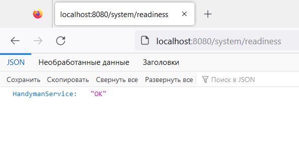
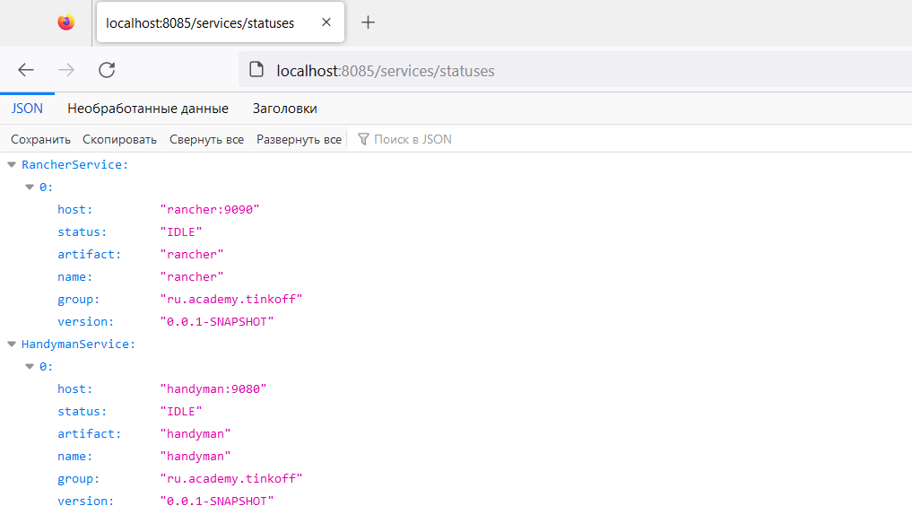
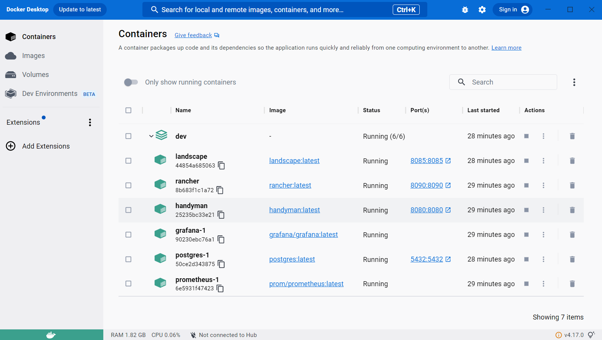

## Сборка проекта
1) Для каждого сервиса в его корневой папке выполнить следующую команду:
- _HandymanService:_ ```DOCKER_BUILDKIT=1 docker build -t handyman .```
- _RancherService:_ ```DOCKER_BUILDKIT=1 docker build -t rancher .```
- _LandscapeService:_ ```DOCKER_BUILDKIT=1 docker build -t landscape .```
2) В папке ```./dev``` выполнить: ```docker-compose up```
## Скриншоты



